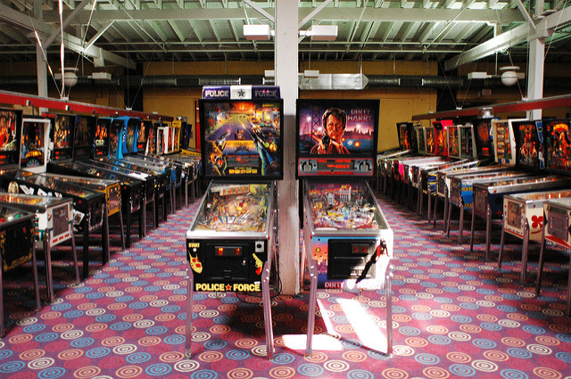

 <small>   <i>police force and dirty harry</i> by marcos ojeda (2009) is licensed under <a href="https://creativecommons.org/licenses/by-nc-nd/2.0/">CC0 2.0</a>   </small>

Portfolio of data displays
==========================

Jake Spears
2019-03-22

Introduction
------------

This portfolio includes data and graphics for both my personal and professional work.It is a constant, evergrowing aggregate of my work.It is displayed in the clearest and most efective ways possible and is wholly my own.

Displays and critiques
----------------------

[Display 1](reports/d1-temp.md) Title of your graph
State the type of graph (strip plot or box plot) and summarize the main points of the report.

Discussion notes
----------------

[Reading responses](reports/reading-responses.md) Notes from the data graphics literature on elements of design and visual rhetoric.

try writing an equation
-----------------------

