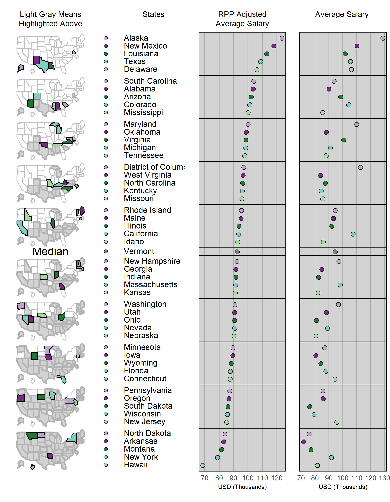

Portfolio of data displays
==========================

Jake Spears
2019-05-20

Introduction
------------

Welcome to my presentation of data graphics! Below is the work stemming from my work into developing skills in the field of data visulaizations. Topics range from useful 3D printing metrics to heart wrenching truths about the social state of our country. I hope that you are able to dive into the data along with the messages that they convey, and that you might leave my repository having gained a little bit of knowdledge, or at least a desire to investingate further into there presented topics.

As it stands, the portfolio below is an collection of my graphical work done for the purpose of Rose Hulman's ME 447 (Visualizing Data) Class. It containes 7 graphs containing a myriad of wide range of different topics. Design and Rhetoric principles from established R community members and data visualization expert were considered when designing the graphics and writing the accompying rhetoric. This purpose of this portfolio under the class discription was to design truthful and compelling data visuals. I have added my personal interests and research, along with my person insight into how the data should be construed in order to reach this goal. I invite any and all discussion and criticism, and would invite you to contact me at <physicsjakedata@gmail.com>.

Displays and critiques
----------------------

[Display 1](reports/d1-mpg-report.md) This display is from the 1970s and 1980s vehicles, and is used to show the effect that the oil shocks had on the industry.

[Display 2](reports/d2-report.md) 2010-2013 Crime and Arrest data from the Los Angeles Police Department. This graph compares the number of arrests in each area of Los Angeles for each reported race.

[Display 3](reports/d3-smoking-report.md) This display focuses on the effects of smoking attributed health care.

[Display 4](reports/d4-mortality-figure.md) 1900-2014 data on life expectancy compared between blacks and whites. Compelling story about the systemic problems within our society and governmental structure.

[Display 5](reports/d5-gas-report.md) 2014 BP Statistical Review on World energy, and its attempts to quiet the opposition of big oil and gas.

[Display 6](reports/d6-3dprinting-report.md) 3D printing data plotted to show which parameters best affect specimen strength, sorted by infill and material.

[Display 7](reports/d7-salary-report.md) Region Price Parity adjusted mean salries for mechanical engineers by state. A review of bang for your buck states for my graduating peers to consider.

Discussion notes
----------------

[Reading responses 1](reports/reading-responses-w2.md) Notes from literature on elements of design and visual rhetoric.

[Reading responses 2](reports/reading-responses-w4.md) Notes from literature on how the structure of data fits the visuals that are being designed.

[Reading responses 3](reports/reading-responses-w6.md) Notes from the art of designing graphs badly. Or, how not to do so.

[Reading responses 4](reports/w8-reading-responses.md) Notes from literature on the importance of discord community and recognizing audience.

[Reading responses 5](reports/w10-reading-responses.md) Notes from literature on the invention of modern data visualizations.

[Presentation response 1](reports/d1-presentation-prompts.md) Notes from weekly presentation

[Presentation response 2](reports/d2-presentation-responses.md) Notes from and portfolio for data graphics.

[College Salary Data Draft](reports/d1-report.md) 2018 Ohio State University Annual Base Salary Review

This report showcases a box plot with Annual Base Salary data for The Ohio State University. The data comes directly from their website at <https://apps.hr.osu.edu/salaries/> . In this report, the annual base salaries are compared across three depratments in the university. These departments are the university itself, its athletic department, and its adjunct health system. Since Ohio State is know widely for their althetics, I wanted to take an in depth look at where the real hiring priorities for the university lie.
