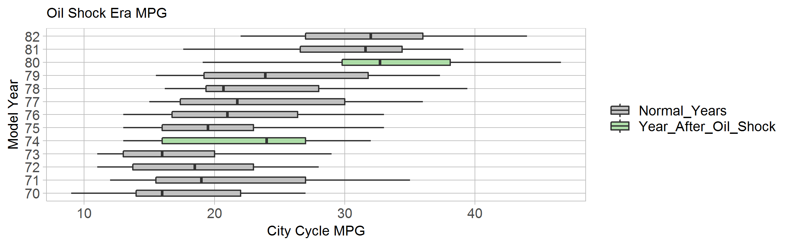

d1-report
================

Introduction
------------

This display illustrates the distribution of city cycle fuel economy for a myriad of vehicles from 1970-82. highlighted are two years that are post oil market supply shocks.

Requirements
------------

This display meets the data requirements for D1 distributions

-   398 observations
-   One ordinal categorical Variable (model year)
-   One discrete quantitative variable
-   One sorting variable (regular time/after oil shock) (special feature)

This display also meets the following document requirements

-   data relevant to problems in my technical area. I am most interested in design and matufacturing, and the oil shocks' immediate effects on the fuel economy of cars being released at the time. This heavily affected the car manufacturing industry, and still shows up as a problem in the field today.

Fuel Economy Graphic
--------------------

Below is my box plot showing the distribution of fuel eceonmy to model year for the myriad of cars in the dataset found at <https://www.kaggle.com/uciml/autompg-dataset>. This data structure was perfect for a distribution display, as it just contained different specifications for these different vehicles. This lead to an an easy to understand distribution between model years of the U.s. car market.

 This graphic is taking a look at the evolution of the cars that were being driven every day in the 1970s and 1980s. The median values inside the boxes show that the average MPG has a upward sloping trend over the entire time span. The really interesting part of this graph is when you consider the "compared to what", or the context within which it lies. This is particularly interesting to me as I studied money and banking this term, and studied the 70s and 80s oil crises. The supply of oil was being cut to the united states, and so prices had been high and supply had been low. This prompted the U.S.consumers to import foreign cars, and forces U.S. companies to adapt their cars to mee this market.

The green boxes show this vital informaiton. Identify the huge jump in mediam fuel economy in both 1974 and 1980, which were both after or during the midst of the oil shocks. Economic crises such as these often shape the innovaiton in the engineering industries, and the oil shocks and their effect on car design and maturfacturing are a very good example of this.

References
----------
