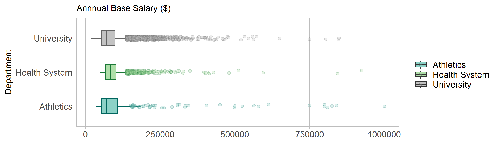

## Ohio State University Annual Base Salary

Below is a box plot of the reported 2018 annual base salaries for The Ohio State University.

The data came in a set of 41,602 observation of 15 different variables from https://apps.hr.osu.edu/salaries/ . From the orignal data set, I kept only the indivuals who were salaried and who had full-time hours. I did not want to scew the data by making projections, so this narrowed me down to 14420 observations. Then I only kept the two variables that are needed for my comparison: department and annual base salary. From this graph I am able to see that the majority of the large outliers above 300,000 are in the athletic department. However, the university does a good job of keeping the averages for the departments similar. This seems to show that while the university does a good job of balancing their funding across their departments, the athletic department seems to get a slight preference for high salaried faculty. This data, however, does not line up with some public records of the school. For example, Urban Meyer, the head football coach for OSU in the 2018 season was reported to have a salary of 7.2 Million. However, in this report his salary is reported as $850,000. Further data and discusison is needed to give a proper answer to how the large sports dynasties affect the other departments.


```{r echo = FALSE}
library("knitr")

```

The box plot is chosen to compare the mean values and the outlying cases in the data. The questions being considered when designing this graph were: How do cross-department sectors of a large "sports" school compare to each other. Does the large sports program take away from the other aspects of the school?
The box plot design provides us a good enough comparison to at the very least provoke further conversation about the institution and its hiring priorities. As Tufte highligts, the two most important things in the graph design are the question that is being answered and the data.[@Tufte:1997]


## References

