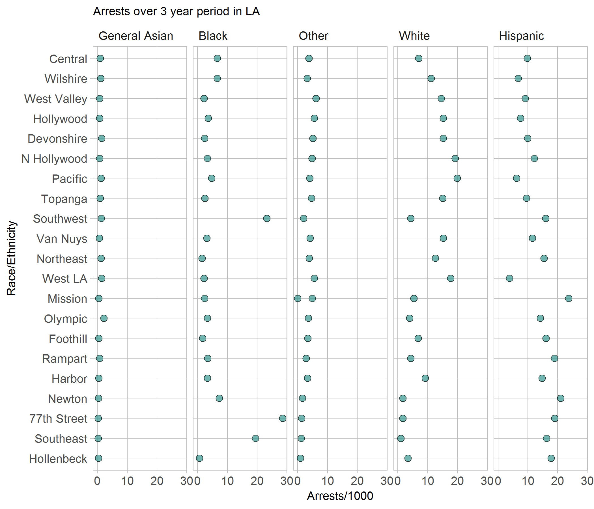

## 2010 - 2013 Los Angeles Crime Data

Below is a graph that highlights the racial distribution of all of the crimes documented by the LAPD from 2010-2013


```{r echo = FALSE}
library("knitr")

```
