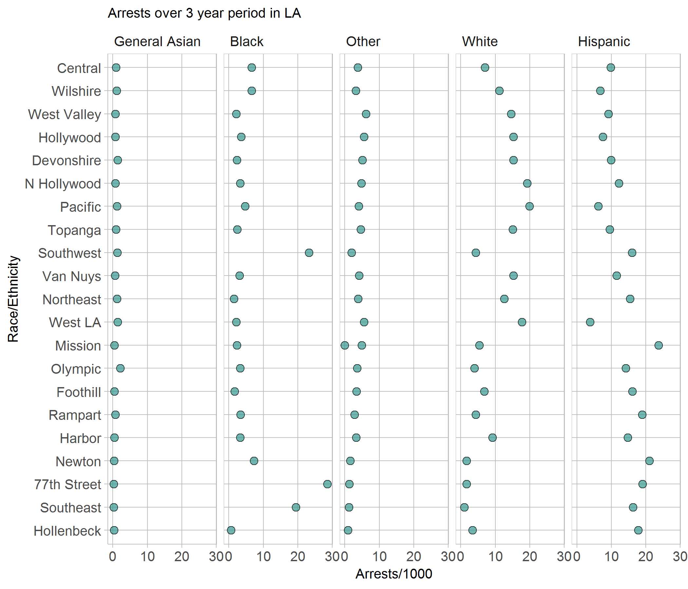

d2-report
================

Introduction
------------

Below is a graph that highlights the racial distribution of all of the crimes documented by the LAPD from 2010-2013. The data is separated into the seperate districts under jurisdiction of the LAPD, and comes from a dataset of over 800,000 observations.

Resources
---------

-   This display meets the requirements for D2 Multiway
-   802,478 observations
-   Race/Ethnicity which is categorical and has 8 levels
-   Location in LA which is categorical, 21 levels
-   One quantitative variable is Arrests/1000

The figure above is a multiway distribution using the LAPD's openly published data on all of their arrests from 2010 - 2013. I have chosen to sort the data by the largest arrest count to easily show outliers. Having the ability to show the outliers against an expected "curve" allows me to be able to show what my real point is. I have chosen to wrap it via race because the race data shows a more interesting story than the area does. The area perspective could be explore in more depth if I could find regional remographics that line up reasonably well with my data. I have chosen to keep this graph as clutter free as possible, so that the viewer just sees the data, and starts to make comparisons. Without population data, conclusions are a bit tougher to reach, however, I will dive into my assessment next.

The most interesting story that is visible to the reader, is the way that the "curves" between the Hispanic and White communities tend to mirror each other. When one is higher the other is usually lower and vice versa. This could mean that there is some sort of bias given the domographic of the areas, or somehting else entirely. Another interesting point is the very high amount of arrests for the black population on 77th Street. This anomoly warrented a small bit of research. The 77th Street area is occupied by mostly Hispanics and Blacks, with Hispanics having the population edge. Since Black arrests are almost 1.5 times higher here, I believe that the 77th street police office should be sunject to criticism and review to make sure that there isn't a structural racism problem within the unit.
