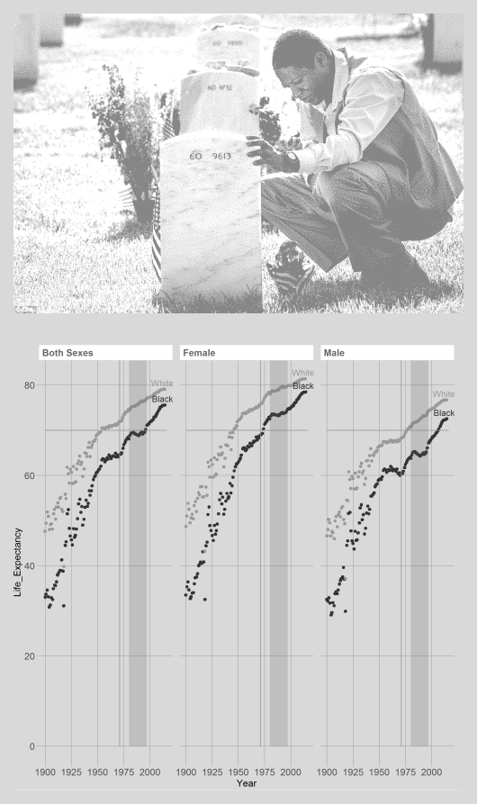

d4-mortality-report
================

Introduction
------------

The graph below shows the disparity between the U.S. life expectancy between two races. It is a very clear discrepancy highlighted by some disturbing political coincidences.

Resources
---------

-   This display meets the requirements for D4 Mortality
-   696 observations
-   one quantitative continuous variable, life expectancy in years
-   one ordinal categorical variable in the year
-   one categorical variables in the form of sex.
-   This graph also meets the requirement for a compelling story, as will be highlighted in a moment.

Ever existing gap between black life expectancy and white life expectancy.
--------------------------------------------------------------------------

Upon first look at the graph, I have intended to keep the overal design newspaper like in feeling. I want it to have some of the soberness that reading about a tragedy would have. There is simply no way to easily explain how this is possible without being baffled. I chose to leave off the legend and make the black line prominently black. It stands out and it is obvious that is is the line of choice. I have also highlighted the region between 1980 and 1997. If you look particularly at the black males during this time, the growing life expectancy for males experiences a drop in slope not felt by the white males.

The region I have selected, upon which this drop falls, is no coincidence. This peroid of time is the height of the drug war, where minorities were being targeted relentelessly by the U.s. Government. I wanted to prominently display the data in this section by drawing this shaded region. Also, I drew an extra horizontal line on the graph at 70 years of life expectancy. If you trace this line from the black curve to the white curve, you find that the black life expectancy is 25-50 years behind the white curve. For perspective, 25 years ago, Internet Exlorer, the first internet explorer was released. Thing of the advancements that come in every industry in that time period. The Black population in the U.S. experiences a lag in life expectancy as if they were using medical technology and less safe transportation form 25 years ago. I have also included the image of the man by his son's grave to drive home the point that this graph is about death. By the data, people of color get to live less life, and that is a deep and somber realization.

Nobody should statistically live a less long or fulfilling life simply because of the color of their skin. Since I believe that this disparity is a result of the effects of the drug war and systemic racism, I believe that this graph will compell you my audience to sit down and take hard look at the real and tangible disadvantages that our brothers and sisters with dark skin are born with. More research needs to be done on why this life expectancy gap still exists, and what immediate changes we can make to solve it.
