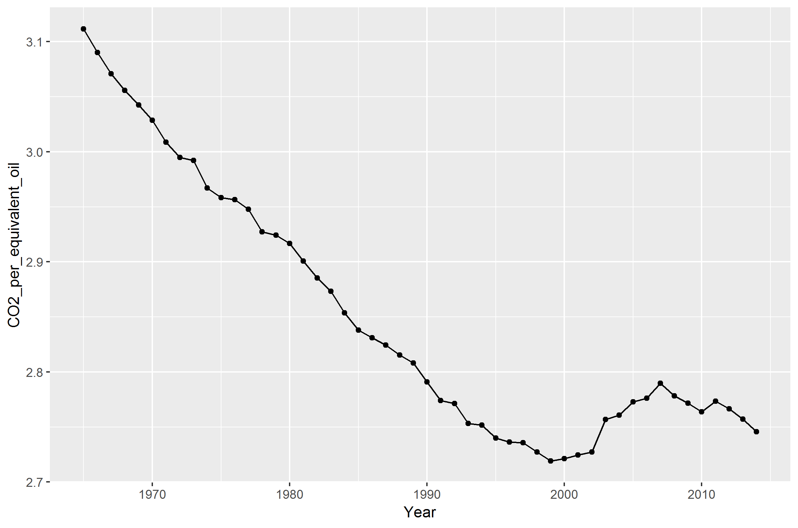

d5-gas-report
================

BP 2014 Statistical Review of World Energy
------------------------------------------

Inside this report from BP, there are many different data values for every part of the world concerning energy consumption. One of the largest, yet overlooked data measures is that for CO2 emissions due to energy production. BP fials to address this data in visual form, but it addresses every over data measure from the report. The closest we get to a visual on emisisons is this graph set for renewable energy consumption by country.

``` r
library("knitr")
include_graphics("../resources/gasreference.png")
```


This set of graphs is misleading. While the data itself is accurate to the report, these graphs are used to imply that global emissions are being improved greatly, as the trend for renewable energies is exponentionally increasing! Unfortunately, this is not the case. This is a case of using the wrong data to mislead the audience. Inside the actual emisisons data, we can find that altough the consumption of these renewable resources as a percentage of total consumption is on the rise, emisisons are not falling in this time period. BP is using these graphs to convey the message that oil is on the fall and that renewables are coming on strong. This has the effect of subduing their opposition. However, the overall consumption is still increasing, and this increase in renewables is not able to combat the new emissions. From data within the same report that these graphs are presented, I am able to create this graph on CO2 per equivalent oil consumption for every year.



References
----------
