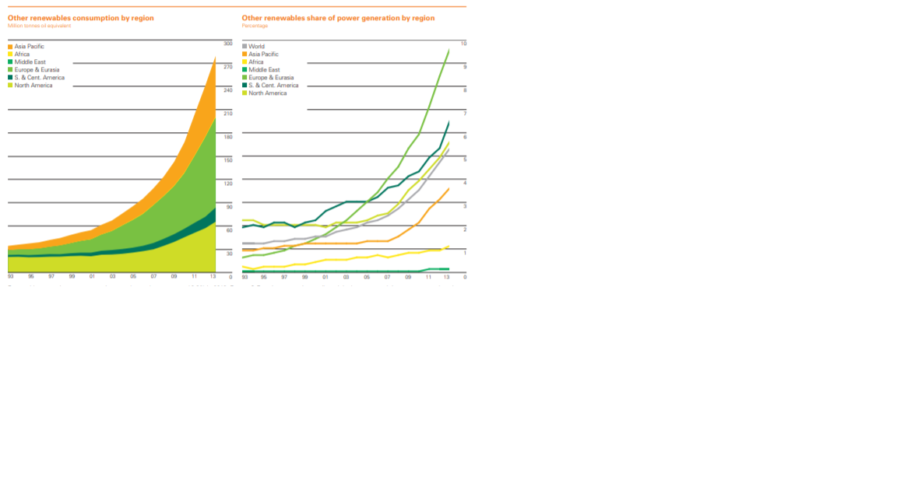
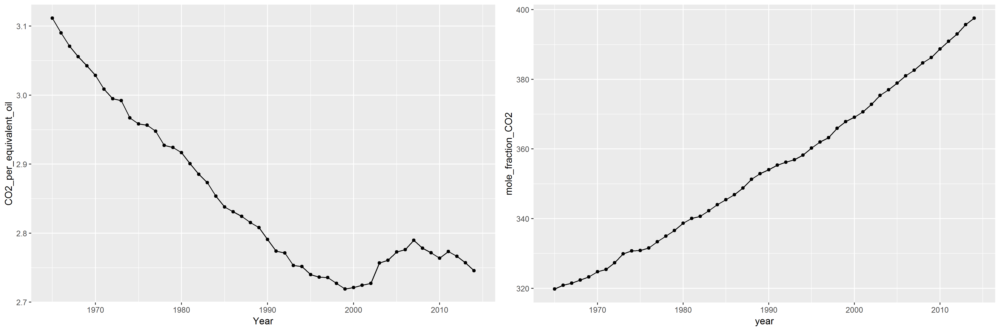

d5-gas-report
================

Introduction
------------

This report details the dishonest practices used by British Petroleum during their annual energy consumption data collection presentation.

Resources (Graph 1)
-------------------

-   This graph is lying graph reference that I had to make for BP
-   50 Observations
-   one quantitative, continuous varabile in effective oil tons of Co2
-   one categorical variable in ordinal years

Resources (Graph 2)
-------------------

-   This graph is a continuation of the redesign
-   50 Observations
-   one quantitative, continuous variable, mole fraction of atmospheric CO2
-   one categorical variable, ordinal years

BP 2014 Statistical Review of World Energy
------------------------------------------

Inside this report from BP, there are many different data values for every part of the world concerning energy consumption. One of the largest, yet overlooked data measures is that for CO2 emissions due to energy production. BP fials to address this data in visual form, but it addresses every over data measure from the report. The closest we get to a visual on emisisons is this graph set for renewable energy consumption by country.

This set of graphs is misleading. While the data itself is accurate to the report, these graphs are used to imply that global emissions are being improved greatly, as the trend for renewable energies is exponentionally increasing! Unfortunately, this is not the case. This is a case of using the wrong data to mislead the audience. Inside the actual emisisons data, we can find that altough the consumption of these renewable resources as a percentage of total consumption is on the rise, emisisons are not falling in this time period. BP is using these graphs to convey the message that oil is on the fall and that renewables are coming on strong. This has the effect of subduing their opposition. However, the overall consumption is still increasing, and this increase in renewables is not able to combat the new emissions. From data within the same report that these graphs are presented, I am able to create this graph on CO2 per equivalent oil consumption for every year.

Here is their claim: 'Worrying: because the power sector is the single most important source of carbon emissions from energy consumption, accounting for over a third of those emissions in 2017. To have any chance of getting on a path consistent with meeting the Paris climate goals there will need to be significant improvements in the power sector. But this is one area where at the global level we haven’t even taken one step forward, we have stood still: perfectly still for the past 20 years. This chart should serve as a wake-up call for all of us."

The chart that BP references as the wakeup call is not cited in their report. However, by taking the data from the report I have made it. It is the left figure in the image below. It sows the amount of effective oil tonnage energy produced every year as a fraction of tonnage of CO2 emmissions. While BP is right in the fact that not enough is being done to combat this issue, this graph is still misleading. The energy poroduction versus CO2 graph makes it seem as if we are doing well in reducing greenhouse emission and that CO2 levels were decreasing.

This simply is not the case. I have taken data from www.co2.com, which has mole fraction of CO2 in the air on global average. Plotting this real level of emissions over the same time frame as the BP data shows that CO2 levels are rising steadily, and at a slightly exponential rate given the small time frame.

References
----------
