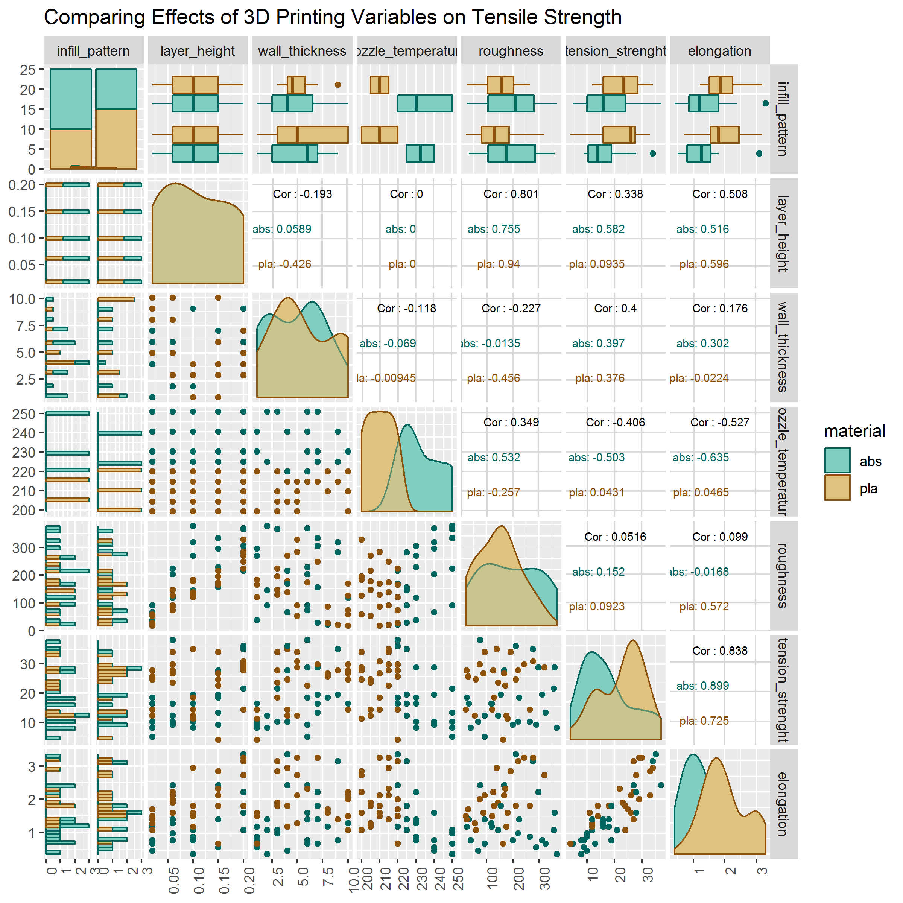

d6-3dprinting-report
================

3D Printing factors and their affect on sample strength
-------------------------------------------------------

Stemming from my research in Materials class in the fall, I have researched 3d printing materials and their tensile strength. I have even obtained some samples from NASA to test. Unfortunately, I did not have enough parameters inside my own data to display it well in multivariate form. So, I found this dataset which includes extremely similar parameters and plotted it for my own reference. The data is obtained on Kaggle at <https://www.kaggle.com/afumetto/3dprinter> . This set containes data for 50 3d printed tensile testing samples. Contained are 12 variables, 2 categorical, and 10 quantitative. I have filtered down The quantitative variables to the 5 which from my experience in the area will have the most effect on the sample. Note that a nozzle temperature, wall thickness, and layer height are all chosen quantitative parameters. On the contrary, tensile strength, elongation, and roughness are resultant values.

Resources
---------

-   This graph meets the requirements for D6 multivariate data
-   This graph also meets soving a problem in my techincal discipline, as I plan to remake it using my own data to improve my 3d printing process
-   50 observations
-   2 categorical variables, infill patten and material type. Both have 2 levels
-   6 shown categorical variables. All are continuous in measurement. They are wall thickness, layer height, nozzle tmperature, roughness, tension strength, and elongation.

I chose the scatterplot matrix because of the ease of picking parameters to weigh against each other. While the parallel coordinate matrix showed some general trends, making adjustments based upon it would require a lot more hassle than necessary. Also, I kept the box and wisker plots included because it allows me to compare an extra categorical variable inside of my graph. This is particularly useful for my interests, because I can look instantly at what infill pattern and what material yields the best strength. Since I also know the prices for the materials and the cost of a particular infill, this would also allwo me to choose the most cost effective material.

References
----------
